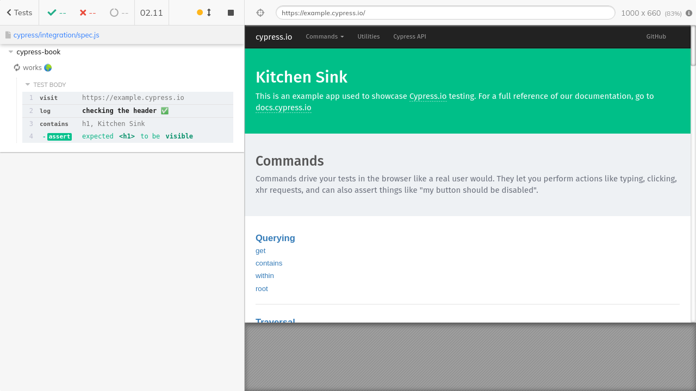

# cypress-book
[![ci status][ci image]][ci url] [![badges status][badges image]][badges url] [![renovate-app badge][renovate-badge]][renovate-app] 
> Utilities for updating Cypress screenshots saved as repo images

## Install

Assuming Cypress is a dev dependency

```
npm i -D cypress-book
# or
yarn add -D cypress-book
```

## Use

Add to the Cypress plugins file

```js
// cypress/plugins/index.js
const { registerPlugin } = require('cypress-book')

module.exports = (on, config) => {
  registerPlugin(on, config)
}
```

Now all screenshots captured will be copied into the `images` folder IF the screenshot is missing, or if the tests are running on CI and the size is different from previous.

See an example test in [cypress/integration/spec.js](cypress/integration/spec.js).

The screenshot below was taking using command

```js
cy.screenshot('hello-world', { capture: 'runner', log: false })
```



You can take the screenshot of the app only without the test runner UI

```js
cy.screenshot('hello-world-page')
```


The screenshots are taken using [cy.screenshot](https://on.cypress.io/screenshot) command.

You should commit the changed files on CI and push back to the repository. See the example GitHub Actions workflow file [.github/workflows/ci.yml](.github/workflows/ci.yml)

### Output folder

By default the images are copied to `images` folder. You can change the name of the output folder using [Cypress environment variables](https://on.cypress.io/environment-variables). For example using the `cypress.json` file, we can direct the plugin to save the images in `images2` folder.

```json
{
  "env": {
    "cypress-book": {
      "imageFolder": "images2"
    }
  }
}
```

Instead of a single output folder, you can create folders relative to the spec file by using relative path in `imageFolder` value.

```json
{
  "env": {
    "cypress-book": {
      "imageFolder": "./pics"
    }
  }
}
```

In the above scenario, if the specs are

```
cypress/
  integration/
    features/
      login-spec.js
    spec.js
```

And each spec saves screenshots, then they will be copied into:

```
cypress/
  integration/
    features/
      pics/
        screenshots ...
      login-spec.js
    picks/
      screenshots ...
    spec.js
```

### Tolerance

Is measured using image byte sizes. You can give the tolerance to consider the images the same.

```json
{
  "env": {
    "cypress-book": {
      "tolerance": 0.005
    }
  }
}
```

The above setting considers the images that are within half percent in byte size to be the same.

### Exclude images

You might not want to copy every screenshot to the images folder. You can skip screenshots using their name by setting a list in the `cypress.json` configuration file:

```json
{
  "env": {
    "cypress-book": {
      "excludeImages": ["social-image"]
    }
  }
}
```

Later on, the screenshot "social-image" will be skipped

```js
cy.screenshot('social-image')
```

## CLI

This package provides a script to copy a given screenshot to the destination, but only replaces the destination image if the same rules apply:

- the destination image does not exist yet
- the copy runs on CI
- the new image is different from the previous image

Use:

```
$ npx copy-image --source "path/to/screenshot.png" --output "path/to/image.png"
```

## Debugging

Run the tests with `DEBUG=cypress-book` environment variable to see verbose log messages using [debug](https://www.npmjs.com/package/debug) module.

## Examples

- [cypress-book-todomvc](https://github.com/bahmutov/cypress-book-todomvc)
- [cypress-examples](https://github.com/bahmutov/cypress-examples)

## See also

- [cypress-movie](http://github.com/bahmutov/cypress-movie)

## Small print

Author: Gleb Bahmutov &lt;gleb.bahmutov@gmail.com&gt; &copy; 2020

- [@bahmutov](https://twitter.com/bahmutov)
- [glebbahmutov.com](https://glebbahmutov.com)
- [blog](https://glebbahmutov.com/blog)

License: MIT - do anything with the code, but don't blame me if it does not work.

Support: if you find any problems with this module, email / tweet /
[open issue](https://github.com/bahmutov/cypress-book/issues) on Github

## MIT License

Copyright (c) 2020 Gleb Bahmutov &lt;gleb.bahmutov@gmail.com&gt;

Permission is hereby granted, free of charge, to any person
obtaining a copy of this software and associated documentation
files (the "Software"), to deal in the Software without
restriction, including without limitation the rights to use,
copy, modify, merge, publish, distribute, sublicense, and/or sell
copies of the Software, and to permit persons to whom the
Software is furnished to do so, subject to the following
conditions:

The above copyright notice and this permission notice shall be
included in all copies or substantial portions of the Software.

THE SOFTWARE IS PROVIDED "AS IS", WITHOUT WARRANTY OF ANY KIND,
EXPRESS OR IMPLIED, INCLUDING BUT NOT LIMITED TO THE WARRANTIES
OF MERCHANTABILITY, FITNESS FOR A PARTICULAR PURPOSE AND
NONINFRINGEMENT. IN NO EVENT SHALL THE AUTHORS OR COPYRIGHT
HOLDERS BE LIABLE FOR ANY CLAIM, DAMAGES OR OTHER LIABILITY,
WHETHER IN AN ACTION OF CONTRACT, TORT OR OTHERWISE, ARISING
FROM, OUT OF OR IN CONNECTION WITH THE SOFTWARE OR THE USE OR
OTHER DEALINGS IN THE SOFTWARE.

[ci image]: https://github.com/bahmutov/cypress-book/workflows/ci/badge.svg?branch=main
[ci url]: https://github.com/bahmutov/cypress-book/actions
[badges image]: https://github.com/bahmutov/cypress-book/workflows/badges/badge.svg?branch=main
[badges url]: https://github.com/bahmutov/cypress-book/actions
[renovate-badge]: https://img.shields.io/badge/renovate-app-blue.svg
[renovate-app]: https://renovateapp.com/
